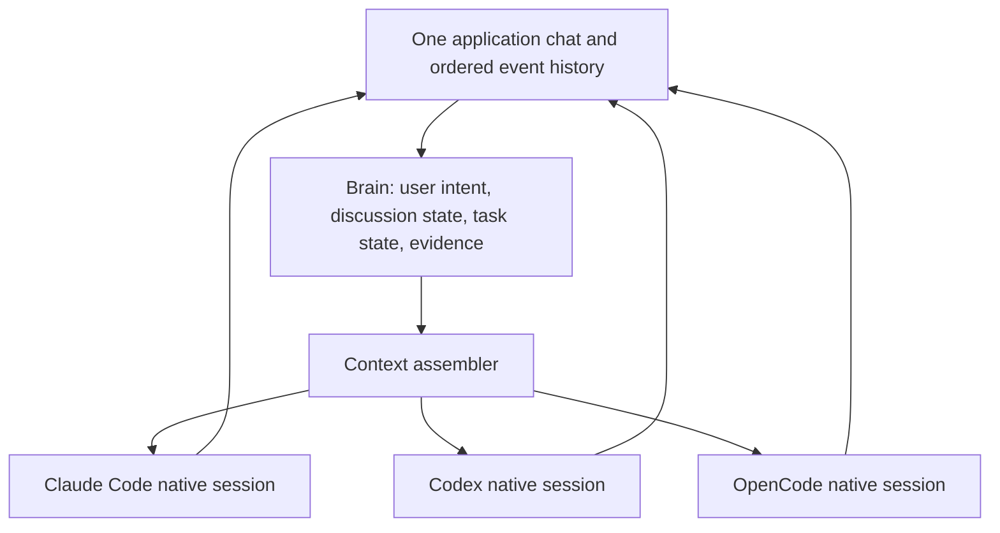

# Brain rewrite: one conversation across multiple native harnesses

Status: revised proposal; runtime implementation has not started.
Updated: 2026-09-27. Branch: `dev/Harsha`.

## 1. Product contract and limits

A chat belongs to the user and the application, not to the selected model.
Switching the model/harness changes who handles the next turn; the conversation,
user requirements, discussions and work history stay with the chat.

Continue using Claude Code, Codex, OpenCode and their supported native interfaces.
They own agent execution, authentication and tools. Brain owns captured evidence,
conversation state, context assembly and synchronization. We are not building a
replacement coding-agent loop or making direct hosted-model calls for coding.

Three different claims must stay separate:

- **Stored:** the application retains captured user messages, assistant output,
  tool events and referenced artifacts, subject to explicit deletion/retention.
- **Supplied:** particular text or summaries were submitted to a particular
  native session. Track the form and sources, not just a last-event number.
- **Understood/retained:** what the model actually understood or what its harness
  kept after compaction. We cannot prove this from successful delivery.

An incoming model does not inherently know what the user told another model.
It knows what its own session retains and what we explicitly supply next.
Retrieval cannot fix a missing detail if neither the assembler nor the agent
knows to search for it. Therefore user discussions and decisions are first-class
context inputs, not just optional similarity-search hits.

No design can guarantee all details of an arbitrarily long conversation inside
a small fixed token budget. Compaction is lossy. The contract is recoverable
captured evidence, strong protection of user intent, explicit overflow behavior,
and measured continuation quality—not a promise of zero forgetting.

## 2. One chat, multiple native sessions

Persist a binding per chat/harness/native-session epoch, with model history,
workspace identity, delivered context coverage and observed session lifecycle.
Do not equate a model name with a native session. A supported same-harness model
change may reuse the session; an incompatible change creates a new one. Discover
and test that behavior per adapter/version. Never give one provider another
provider's native resume cursor.

Example of sequential switching within one chat:

| Moment | Chat history | What the selected session receives |
| --- | --- | --- |
| Claude handles initial work | E1–E30 | Initial request and its normal native conversation |
| Switch to Codex | E1–E30 plus new request | Exact history if it fits; otherwise user-intent/discussion/task checkpoint plus recent evidence |
| Codex finishes more work | E31–E45 | Its native session records its own turn; Brain records observed results |
| Switch to OpenCode | E1–E45 plus new request | A fresh reconstruction of this same chat, not merely Codex's last answer |
| Return to Claude | Claude last participated at E30 | Changes after E30, current active instructions, discussion updates and workspace changes |

The E30 boundary describes synchronization history, not certainty that Claude
still retains every original token. If the native session is missing, incompatible
or known to have compacted away needed context, use a fuller reconstruction.
Critical active constraints are included on cross-harness returns even if an
older version was previously submitted. Corrections identify what they supersede.

Do not eagerly send every new message to all idle sessions. Persist once and
synchronize the target just before its next turn. Switching the picker while idle
selects the next target; it should not itself spend an agent turn.

## 3. Switching versus genuinely simultaneous work

### Default: one active foreground turn in a chat

Support any number of sequential model switches, but one active foreground run
and one owner of repository mutations in that workspace. This matches a single
conversation without racing assistants.

- Each submitted request captures its target model/harness, request ID and input
  event boundary. Later picker changes do not retarget an already submitted job.
- Switching during a run offers finish-then-switch or interrupt-then-switch.
  Default to finish-then-switch; the UI shows the pending target.
- Do not start the replacement writer until the prior run is quiescent. A UI
  cancellation is not evidence that a subprocess stopped writing.
- User messages arriving during a run are persisted immediately. Deliver steering
  only when supported; otherwise queue it with a visible target and ordering.
- Rapid picker changes can coalesce unsubmitted selections, never committed
  requests. Queued requests retain their destination unless explicitly changed.
- Late provider events are tagged with native session, epoch and run ID. Retain
  them in the right run, without overwriting the current session or task state.
- Show a successful switch only after target startup succeeds. A failed startup
  keeps history and pending instructions intact and reports the actual binding.

### Optional later mode: ask multiple models in parallel

Treat parallel work as sibling runs within the same chat, not a shared native
session. Each run starts from an explicit immutable conversation/workspace
snapshot. Answers are labeled by model and snapshot. One model does not magically
observe another model's streaming answer or subsequent user correction.

First parallel feature should be compare/review against a fixed snapshot, with
verified read-only access or isolated copies. Read-only tools against a directory
being modified by another run do not provide a consistent snapshot.

For parallel coding, use separate worktrees and an explicit integration step;
never two unrestricted writers in the same working tree. A source worktree's
test result or edit is not automatically true in the destination workspace.

A new instruction during parallel work has explicit routing: one run, all runs,
or the next foreground turn. Record delivery per run. If steering is unsupported,
stop/restart or queue the update; do not label a stale run as synchronized.

Reconcile outputs into the chat as attributed proposals and evidence. Arrival
order does not turn a conflicting proposal into an accepted decision. User
acceptance or an explicit task policy determines what becomes shared task state.
The next foreground run receives reconciled results and unresolved disagreements.

## 4. Preserving what the user said, including small points

Do not reduce a conversation to a list of major engineering decisions. Preserve
preferences, exploratory discussion, rejected options, unanswered questions,
examples and deferred ideas as well as explicit instructions.

### Exact evidence and protected user intent

Every user message remains an exact, source-addressable event. Keep its attached
artifacts and links to neighboring exchanges. Store explicit active instructions,
corrections and accepted decisions with their exact source wording and enough
surrounding context to avoid changing their meaning.

Examples from this conversation:

| User statement | Representation and treatment |
| --- | --- |
| Use existing harnesses; do not build our own agent loop | Active architectural constraint, supplied on switches |
| Next.js is likely, but the framework is not chosen | Tentative preference; never silently upgraded to a final choice |
| Haiku/Luna through the harness is an option for summaries | Permitted helper approach, subject to availability; not a mandatory model ID |
| A small preference such as “keep filenames lowercase” | Exact active preference until superseded, even if unrelated to retrieval keywords |
| “What about another storage option?” | Discussion/open question, not an accepted storage decision |

Instruction extraction is fallible. Do not let a helper classifier be the only
route by which user text reaches the next model. Include unsummarized new user
messages verbatim where they fit. Require a source-coverage pass before replacing
older user exchanges with discussion summaries. A message's appearance in that
coverage manifest proves processing, not that every nuance survived.

Do not require users to pin every important statement. Offer pin/edit/review as
an additional control. Pins, explicit constraints and the current request have
mandatory retention; conflicting or ambiguous instructions are carried as such
rather than silently resolved by a summarizer.

### Conversation/discussion ledger

Maintain a versioned topic ledger for the whole chat, separate from task progress.
Each entry has the point discussed, status (exploring, tentative, accepted,
rejected, deferred, unanswered or superseded), participants, source events and
related decisions. Preserve the why, not only the final noun or chosen option.

Every user message must have a recorded disposition: included verbatim, represented
in a source-linked topic/checkpoint, superseded with a reference, or available
only in the archive. Nothing disappears solely because a similarity score is low.
A compact topic map lets a new session know that older discussion exists, even
when its full detail is not inline. If even this map needs hierarchical grouping,
record that compression and its source coverage; do not imply exact recall.

### Four sources of context, in order

1. Current request, pinned content, active constraints/corrections and accepted
   decisions relevant to the chat; unresolved conflicts remain visible.
2. Current task state and conversation/discussion ledger, including preferences,
   unanswered questions and deferred points—not only “work completed.”
3. Recent complete exchanges and changes since this session last participated,
   prioritizing exact user wording over verbose assistant narration or logs.
4. Retrieved older evidence relevant to the request, files, symbols and topics.

A new session needs the discussion checkpoint even if its immediate coding task
has few matching keywords. A returning session needs changed topic entries and
newly relevant older evidence as well as the delta. Cross-chat knowledge requires
explicit project scope; a shared project database is not permission to mix chats.

This protects small points better than top-k retrieval alone, but it cannot
eliminate summary omissions or model forgetfulness. Evaluate small-point recall
and keep original evidence accessible with source IDs, not just opaque hashes.

## 5. Context budgets and compaction from the first milestone

### Prefer full fidelity when affordable

If the captured conversation fits the configured handoff budget, pass the exact
relevant conversation rather than summarizing it unnecessarily. As it grows,
compress older assistant narration and oversized tool output before compressing
user discussion. Preserve important tool outcomes, commands, exit codes and
current workspace facts; keep raw output retrievable.

For long chats, use protected user intent + task/discussion checkpoint + recent
exchanges + retrieved evidence. Do not replay the entire growing archive on each
switch. Do not retain only the most recent entries: that can discard the original
request while preserving a large recent log.

Earlier 1–3k return / 3–6k fresh-session estimates are now **soft starting targets**,
not correctness guarantees or fixed caps. The priority is adequate representation
of user intent. Set a separate configurable hard ceiling for added context and
reserve capacity for harness overhead, the user's request and response when known.
Use target tokenizers where available and label estimates when overhead is hidden.

Overflow handling:

1. Remove duplicate evidence and lower-priority tool verbosity.
2. Reuse or generate validated source-backed checkpoints for older segments.
3. Expand within the configured ceiling if mandatory content needs more room.
4. If mandatory material still does not fit, report the conflict and offer a
   larger budget, narrower scope or new focused conversation. Never silently
   discard requirements or return an empty handoff because one entry is huge.

### Two kinds of compaction

Brain compaction changes what we supply, while preserving captured originals.
Harness compaction changes what the native agent retains, often outside our
visibility. Detect supported signals and keep session retention uncertainty
separate from submitted coverage. Refresh protected state on return and after
observable compaction; do not claim a model remembers content just because it
was submitted earlier.

Generate segment summaries and task/discussion checkpoints from source events.
Keep source coverage, prompt/model revision and validation results. Avoid endless
summary-of-summary degradation: periodically rebuild from source segments and
original active instructions. Validate schemas, source IDs, statuses, numbers,
paths and tool outcomes. Source citations alone do not prove semantic fidelity.

A low-cost harness helper may produce summaries in the background. Reuse them
on switch, avoid an extra acknowledgement turn, and keep a deterministic fallback.
If a helper is unavailable and missing user content cannot fit without a new
summary, use the overflow path rather than silently dropping it to stay fast.

### What this does and does not save

Example only: replaying 100k tokens ten times adds 1,000,000 tokens. One 5k
reconstruction plus nine 1.5k deltas adds 18,500, if those packages adequately
represent that particular task. That arithmetic says nothing about actual total
billing or subscription allowance savings.

The harness may resend its own accumulated history. Its internal instructions,
tool schemas, native compaction and provider caching affect actual input.
Caches do not transfer across providers. Local embeddings save remote retrieval
work; their vectors cannot replace readable text in an agent prompt. Harness
helper calls also consume allowance, and their summaries consume input tokens
when delivered. Measure helper usage, added-context estimates and total/cached
usage separately where reported; otherwise label unknowns.

Do not synchronize idle sessions eagerly. Trigger helper work at bounded tail
thresholds or milestones, deduplicate by source hash and cap concurrency/usage.
Offer a concise context view: preserved instructions, topic/task checkpoint,
exact excerpts, omitted detail, sources and estimated overhead. No routine
confirmation is required unless a real budget/scope conflict remains.

## 6. Evidence delivery and retrieval

The synchronization operation persists an immutable package tied to the target
session epoch, conversation boundary and workspace revision before submission.
States: prepared -> submitting -> accepted, failed or outcome-unknown. Acceptance
means the strongest supported transport/session signal, not understanding.

After a crash, reconcile using native request IDs/events where possible. Without
harness idempotency, exactly-once delivery is not guaranteed. Do not blindly
resubmit an action prompt with unknown outcome; first inspect the session and
workspace. Never replay recorded tool execution as part of context reconstruction.

Keep coverage as exact/summarized/referenced/omitted for each source range, plus
retention uncertainty after native compaction. A high-water mark alone is not
proof that the target received all detail. New evidence arriving after the package
snapshot enters a subsequent delta; it must not race into an already frozen input.

Retrieval augments the protected state and topic ledger:

1. Filter by chat/project/workspace and source authority before ranking.
2. Combine exact path/symbol matching, SQLite FTS5 and optional semantic results.
3. Fuse rankings, deduplicate overlap, prefer valid/current evidence and respect
   the remaining token budget. Semantic recall must not be restricted to lexical
   candidates alone, or synonym matches disappear.
4. Resolve references through paginated source reads/search, via supported MCP
   or a local file/CLI export. A reference is not equivalent to supplying its text.
5. Bound cumulative retrieval output per turn, with explicit expansion when
   needed. Critical instructions never depend on optional tool reads.

Chunk by complete conversational/tool units, splitting oversized content at
meaningful boundaries. Preserve final outcomes rather than longer partial output;
include relevant stdout and stderr. Images retain artifacts and capability-aware
representations; an image reference does not give a text-only model visual access.

Start exact vector search over eligible per-project chunks in a worker. Benchmark
1k/10k/100k chunks before adding ANN complexity. Cache embeddings by source hash,
model revision and preprocessing. Respect tokenizer limits; lexical retrieval
continues if models are cold, unavailable or disabled.

## 7. Storage: SQLite plus files; JSONL for interchange

Use the existing per-project `.loom/log.db` as the canonical database, extending
it with versioned migrations. Preserve existing event IDs and public EventLog
contracts. Avoid introducing a second authoritative event store.

| Data | Storage | Reason |
| --- | --- | --- |
| Captured messages, tool lifecycle and task events | SQLite events, with JSON payloads | Ordered history, transactions, filtering and durable references |
| Instructions, task state, memories, summaries | SQLite tables referencing source events | Provenance, revisions, scope and atomic updates |
| Native session bindings and handoff delivery state | SQLite tables | Survive crashes, retries and app restarts |
| Searchable chunks | SQLite tables + FTS5 index | Exact strings and lexical retrieval without a model |
| Embeddings | SQLite BLOBs with model/version metadata | Rebuildable index; no JSON vector-file rewrite on each update |
| Large tool output, diffs, images and attachments | Content-addressed files under `.loom/artifacts/` | Keep oversized binary/text payloads out of hot database rows |
| Export/import and diagnostics | Versioned JSONL + artifact manifest | Portable and inspectable, not a live mirror that can diverge |
| Optional handoff Markdown | Derived export | Compatibility with harness file reads; not the source of truth |

FTS5 is SQLite's full-text-search module; verify it exists in the packaged SQLite
runtime rather than assume every build enables it. [SQLite FTS5 documentation](https://www.sqlite.org/fts5.html).

Use one writer service per project; database work stays outside Electron's
renderer/main event loop. Start with WAL on a supported local filesystem,
foreign keys, busy timeout and explicit transactions. Handle another app/daemon
trying to own the same project. WAL needs checkpoint/backup handling and is not
appropriate for shared access across machines on network filesystems. Use the
SQLite backup mechanism or a coordinated checkpointed backup, not a live copy
of only `log.db`. [SQLite WAL documentation](https://www.sqlite.org/wal.html).

Write artifacts to a temporary file, hash and atomically rename before committing
the referencing database transaction. A crash can leave an unreferenced file;
clean those after a grace period. A committed reference must never point to an
unfinished write. Export includes referenced artifacts and checksums.

Proposed logical tables (final DDL follows migration design):

- `events`: preserve current schema; add versioned payload conventions and
  idempotent harness event identity where available. Coalesce streaming deltas
  into message versions; do not embed every token fragment.
- `artifacts`: hash, relative path, media type, byte length and capture metadata.
- `instructions`: exact source span, conversation/project scope, active or
  superseded status, source event and revision. Inferred constraints remain
  proposals; they cannot silently become user instructions.
- `task_states`: objective, completed/open work and source-backed claims,
  versioned by conversation. A reported test success includes command, outcome
  and workspace revision; later edits invalidate its applicability.
- `memories`: durable facts, source IDs, confidence, scope, supersession,
  freshness and affected files. Keep contradictory claims visible until resolved.
- `chunks` / `chunks_fts`: source range, scope, file/symbol entities, text hash.
- `embeddings`: chunk ID, text hash, model revision, dimension, pooling and
  normalization configuration, vector bytes. Never compare incompatible vectors.
- `summaries`: coverage manifest of event IDs/ranges, exclusions, source hash,
  model/prompt revision, structured output and validation result.
- `sessions`: conversation, harness, native session ID, workspace identity,
  epoch and observed lifecycle. A recreated session gets a new epoch.
- `handoffs`: target epoch, source coverage, workspace revision, package hash,
  estimated tokens, payload and delivery state.
- `session_coverage`: what was submitted to each native session, with evidence
  strength. Distinguish full evidence, summarized coverage and references.

A cursor alone is insufficient: submitting a summary through event 900 does not
mean the target has the full contents of every event through 900.

Default retention preserves captured history. User deletion/retention must also
invalidate summaries and remove derived indexes; artifact GC follows references.
Capture normal harness output, not credentials or provider-internal state.

## 8. Models and helper policy and recommendation

Research checked 2026-09-27 against publisher model cards. No model was downloaded
or benchmarked on this machine. Recommendations are candidates for evaluation,
not claims of measured performance or the best model on every device.

Embedding models retrieve text; a separate generative model can summarize it.

| Candidate | Verified characteristics | Proposed role |
| --- | --- | --- |
| [Qwen3-Embedding-0.6B](https://huggingface.co/Qwen/Qwen3-Embedding-0.6B-GGUF) | 0.6B parameters; 32k input context; up to 1,024 dimensions; publisher GGUF Q8_0/F16 variants and Apache-2.0 model-card label | First quality-oriented retrieval candidate; evaluate 512 and 1,024 dimensions with the required query instructions |
| [EmbeddingGemma-300M](https://huggingface.co/google/embeddinggemma-300m) | 300M parameters; 2,048-token input; 768 dimensions reducible to 512/256/128; Gemma terms linked on card; reference implementation cautions against float16 activations | Smaller multilingual alternative; benchmark 256/512 dimensions and supported runtime/quantization combinations |
| [all-MiniLM-L6-v2](https://huggingface.co/sentence-transformers/all-MiniLM-L6-v2) | 384-dimensional short-text embeddings; default truncation above 256 word pieces | Low-resource baseline; current repository already integrates a quantized conversion optionally |
| [Qwen3-4B](https://huggingface.co/Qwen/Qwen3-4B) | Generative model with documented non-thinking mode | Optional local structured-summary candidate; test a pinned 4-bit conversion, bounded input batches and source validation |

Updated recommendation after user input: **FTS5/exact retrieval always available;
use a low-cost harness model for optional summaries and thread/session metadata;
keep local embeddings and local summarization as independent options.** Benchmark
Qwen3 Embedding 0.6B against EmbeddingGemma and MiniLM before selecting a local
embedding download. Qwen3-4B is an offline summary candidate, not a required
installation. Switching works with deterministic/extractive context if every
helper is unavailable.

Qwen3-4B is substantially heavier than an embedding encoder. Four billion
weights at four bits is approximately 2 GB of weights alone by arithmetic;
quantization metadata, runtime buffers and KV cache add to this. This is not
an artifact download size or an observed peak RAM figure. Avoid advertising
model parameter count as a device memory requirement.

Run local inference in a supervised background process. Evaluate a pinned
llama.cpp runtime for publisher GGUF embeddings and a compatible summarizer;
retain ONNX as a candidate for MiniLM. Validate pooling, query prefixes,
normalization and quantization against reference outputs. No Python runtime
requirement for shipped desktop builds; prototype tools may differ.

Model files live in the user's app-data/model cache, shared across projects.
Downloads are explicit, resumable and checksum-verified; pin model/runtime
revisions, surface applicable model terms, and function offline afterward.
Load models lazily, cap threads/RAM, unload idle summarizers, and avoid concurrent
embedding/summarization work when it degrades the active coding harness.

### Harness-backed helpers: preferred first generative integration

The user proposes Haiku or Luna where available through the underlying harness.
Treat those as selectable model names, not universal provider/model IDs. Discover
or validate models through each adapter's supported capabilities, persist the
resolved model identity, and never silently substitute an expensive model. This
plan does not claim that every harness exposes either name. The inspected T3 Code
checkout defaults to `gpt-6-luna` for Codex text generation and
`claude-haiku-4-5` for Claude text generation, using structured, restricted CLI
calls. Its helper interface covers titles and Git metadata, not shared context
summaries. See the [pinned reference notes](t3code-reference.md). Model availability
and usage accounting still need capability tests for the installed harness version.

Define a small `ContextHelper` interface with interchangeable harness-backed,
local and deterministic implementations. Return structured results plus source
references, helper model/session identity, latency and reported usage.

| Job | Harness helper use | Trigger / default policy |
| --- | --- | --- |
| Task checkpoint / compaction | Summarize bounded source segments into the validated task-state schema | Background threshold or milestone; reuse on switch |
| Thread title | Generate a short title from the initial request | Once; never overwrite a user title |
| Session description / thread recap | Produce display metadata or a source-backed recap | On meaningful change or explicit request; not on every render |
| Durable-memory candidates | Propose sourced facts/decisions | At completed turns; no authority to overwrite explicit instructions |
| Query expansion | Suggest alternative terms for FTS5 | Only when lexical retrieval is weak; bounded timeout |
| Reranking | Rank an already scoped, capped candidate set by ID | Optional quality mode; not required on every turn |

A chat helper is not automatically an embedding endpoint. FTS5/entity search can
work without vectors. If semantic embeddings are enabled, compute them locally
unless a harness explicitly offers a supported embedding operation. Chat-written
keywords or relevance scores are not numerical embeddings and should not be
stored or compared as vectors.

Run helper work in an isolated native session, separate from the user's coding
sessions. Restrict tool access using verified harness capabilities; do not rely
on a prompt alone to prevent edits. For a harness without an enforceable no-tool
mode, use a dedicated temporary workspace with minimal filesystem access and
an explicit capability review before enabling background helpers. Supply only
the bounded, scoped excerpts needed for the job. Never modify project-wide model
settings or interrupt the active coding agent to obtain a summary.

Keep helper outputs in a maintenance namespace: they cannot recursively trigger
more extraction/title generation, appear as user instructions, or advance the
coding session's synchronization coverage. If a tool-free output schema cannot
be enforced, parse and validate the response and fall back on malformed output.

Suggested configurable controls: one concurrent helper job, input/output token
caps per job, a per-conversation token budget, cooldown, timeouts and cancellation.
Deduplicate jobs by source hash + task type + model/prompt revision. Prioritize
foreground coding and pending handoffs over optional titles or reranking.
Expose the source scope and helper usage in diagnostics. When the account is
rate-limited or the budget is exhausted, reuse a valid checkpoint or use the
extractive fallback rather than launching more requests.

Lower-cost does not mean quota-free: the helper uses the harness account's
allowance, and the resulting summary consumes input tokens when delivered to
the coding model. Measure both overheads where the harness exposes usage; do not
infer subscription savings from API prices. Local mode avoids hosted helper
usage, but the context delivered to the coding harness still consumes input.
A provider-down switch must not depend on asking that same provider to summarize
first. Maintain checkpoints ahead of time; if fallback cannot preserve mandatory
content within budget, surface the overflow rather than silently dropping it.

## 9. Architecture and migration boundaries

| Module | Ownership |
| --- | --- |
| BrainStore | Captured events, artifact references, migrations and transactional state |
| ConversationState | Exact user intent, decisions, topic ledger, task progress and source-backed checkpoints |
| ContextAssembler | Token-aware exact replay, reconstruction and deltas with coverage manifests |
| SessionSync | Target binding, run/switch serialization, delivery tracking and crash recovery |
| Retrieval | Scoped lexical/entity/semantic search and rebuildable indexes |
| ContextHelper | Budgeted harness/local summary and metadata jobs with deterministic fallback |
| LocalModels | Optional inference process and embedding lifecycle |

Keep the current EventLog API and native adapters. Move existing responsibilities
out of `core/projection.ts`, `core/distill.ts`, `core/memory.ts` and
`daemon/runtime/briefings.ts` behind these modules, then remove redundant paths.
Native instruction-file import remains a sourced input, not a private transcript
import. Team memory and bridge exports use the same explicit scoping rules.

Add `runs` and parent snapshot/branch relationships for eventual parallel work,
`topics` and source dispositions for discussion coverage, and versioned workspace
observations to the proposed tables above. Helper maintenance events cannot pollute
user conversation state or recursively trigger extraction.

Migrate existing SQLite events/Brain memory events without renumbering sources.
Import old JSONL with an idempotent manifest and count/hash reconciliation. If
both stores contain distinct data, require an explicit merge policy; never assume
one is empty. Back up before cutover and version new schemas/exports. Rollback
must include events captured after cutover, not simply restore yesterday's backup.
Use a feature flag and shadow-build packages before changing the sole context
producer. Do not submit duplicate prompts during shadow evaluation.

Retire fixed character truncation, volatile pendingBriefings and vectors.json
rewrites only after compatibility coverage passes. Test the existing semantic
loader's explicit offline path before reusing it: its current `allowRemoteModels`
assignment appears inconsistent with offline=true.

## 10. Implementation order and TODO

Only this proposal is complete. The runtime rewrite remains unimplemented.

- [ ] Phase 0 — Capability fixtures: supported model changes, resume, input
  injection, usage, interruption/quiescence, native compaction visibility,
  tool lifecycle, session expiration and read/search access for each harness.
- [ ] Phase 1 — Extend durable storage and build the exact conversation capture,
  user-intent and topic/task state pipeline. Preserve undecided discussions and
  small preferences. Add source-disposition and correction/supersession tests.
- [ ] Phase 2 — Sequential same-chat switching: Claude -> Codex -> OpenCode ->
  Claude. Exact replay when small; initial deterministic compaction, protected
  state, scoped lexical retrieval and durable delta delivery when large.
  Validate interruption, rapid switches, queued steering and restart recovery.
- [ ] Phase 3 — Low-cost harness summaries and thread/session metadata. Isolated
  helper sessions, source validation, usage caps, deduplication and fallback.
  Evaluate against exact replay and deterministic checkpoints before defaulting on.
- [ ] Phase 4 — Optional local embedding benchmark and implementation; optional
  local summaries for offline/privacy preferences. Version indexes and model recipes.
- [ ] Phase 5 — Explicit parallel compare/review mode on fixed snapshots. Add
  parallel coding/worktree integration only as a separate, tested capability.
- [ ] Phase 6 — Migrate team/bridge consumers, remove superseded context code,
  document limits and run packaging/cross-platform/long-conversation tests.

Do not delay proving sequential continuity until every optional model or parallel
feature is implemented. Do not claim seamless long-chat support before user-intent
coverage, compaction and overflow handling exist.

## 11. Acceptance criteria

Deterministic CI uses fake harnesses and replay fixtures. Live harness evaluation
is separate, explicitly enabled, and can consume the user's account allowance.
Evaluate actual task continuation as well as question answering about history.

| Scenario | Required behavior |
| --- | --- |
| Small chat, new model | Exact supplied conversation fits; no unnecessary summarization |
| Small preference far back in history | Preserved in active intent/discussion state, even without keyword overlap |
| Tentative discussion | Remains tentative; not promoted to an accepted decision |
| User changes their mind | New instruction explicitly supersedes old one; source history remains available |
| Return after two other models worked | Receives intervening work and discussion updates from both |
| Newest event is larger than the budget | Nonempty valid package or explicit overflow, never silent context loss |
| Too many active instructions | Budget/scope conflict surfaced; no silent requirement truncation |
| Helper omits a user point | Coverage/fidelity evaluation catches known fixture omissions; originals recoverable |
| Native session compacted or lost | Bounded reconstruction; submitted coverage is not mistaken for retained memory |
| Tool failed without assistant narration | Exit code and relevant output remain in task evidence |
| Attachment-only request | Artifact preserved and handled according to target modality support |
| Switch during tool execution | No replacement writer until the old one is safely quiescent |
| Late event / duplicate event | Routed to the correct run/epoch and deduplicated without overwriting current state |
| Two models run concurrently | Explicit common snapshot, isolated mutations and attributed conflicting outputs |
| New user correction during parallel runs | Delivery recorded separately; stale output not accepted as current state |
| Provider/account unavailable | Checkpoint/fallback works without requiring that provider to summarize first |
| Crash after submitting an action | Reconcile unknown outcome; no blind duplicate execution |
| Multiple chats in one project | No accidental cross-chat context leakage |

Measure instruction/decision retention, small-point recall, unsupported additions,
source fidelity, task completion, unnecessary re-investigation, latency and total
reported token usage. Set factual quality gates using a labeled conversation set;
a checklist or source citation alone does not prove arbitrary semantic fidelity.

Performance targets, not measurements: warm deterministic package assembly under
250 ms p95 at 10k chunks on an agreed reference machine; optional semantic retrieval
under 500 ms p95. Exclude harness/network startup from those measurements and
report total user-visible switch latency separately. Measure peak RSS, CPU/battery,
model cold start/download size and storage growth at 1k/10k/100k chunks. Compare
8 GB CPU-only and 16 GB Apple Silicon evaluation profiles before promising support.

## Implementation foundation

The prerequisite module separation is tracked in
[Brain-ready boundaries](../refactoring/BOUNDARIES.md). Event persistence,
conversation metadata, native adapter state/lifecycle, context preparation and
client delivery now have distinct owners. The existing storage formats and
context-selection policy remain in place; this foundation is not completion of
the continuity phases above.

## 12. T3 Code reference and what we adopt

The local checkout at `/Volumes/Programming Vault/t3code`, inspected at commit
`de251fc2971a884cb5b1305ba4daf309dc8cccb0`, remains a read-only reference.
Its current command reactor rejects cross-driver continuation and incompatible
resume identities. The earlier PR's handoff implementation is therefore not
evidence that this checkout supports our proposed switching behavior.
[Reference notes](t3code-reference.md) record verified helper, persistence,
streaming and desktop patterns with pinned source links.

Carry these constraints into implementation: identify native sessions by provider
instance and resume compatibility, not model name alone; isolate helper work from
foreground sessions; coalesce UI projections without dropping canonical history;
keep database and harness work outside the Electron renderer. These observations
do not establish measured performance or replace Loom's capability tests.

Inspected on 2026-09-27: [PR #3799](https://github.com/pingdotgg/t3code/pull/3799),
head `853c8d5e306ad1cd7489197ca025599ae0eb2448`, was closed without merging. The
maintainer referred it to [orchestration V2 #2829](https://github.com/pingdotgg/t3code/pull/2829).
These are reference observations, not claims that the feature shipped.

Adopt the separation of app conversation from native provider resume state,
fresh-session fallback, actual tool outcomes, and success notices after startup.
Its [handoff renderer](https://github.com/pingdotgg/t3code/blob/853c8d5e306ad1cd7489197ca025599ae0eb2448/apps/server/src/orchestration/providerHandoffTranscript.ts)
uses an 80k-character recent-history cap and 600-character tool-output excerpts.
A newest entry over budget can leave the selection empty. Use these as regression
fixtures; replace blind recent-history selection with the fidelity-first policy
above. Source inspected, PR not executed locally.

## 13. Remaining product decisions

Default to sequential switching; parallel work is an explicitly selected later
mode. Confirm allowed helper models and budgets, reference hardware, maximum
handoff overhead, retention controls and whether a larger package is preferable
to narrowing scope when intent exceeds budget. Preserve the user's option to
inspect/pin/correct context without making manual curation necessary for every turn.

Framework selection and the Electron UI redesign remain separate work. This
proposal changes context ownership and continuity, not the native agent harnesses.
